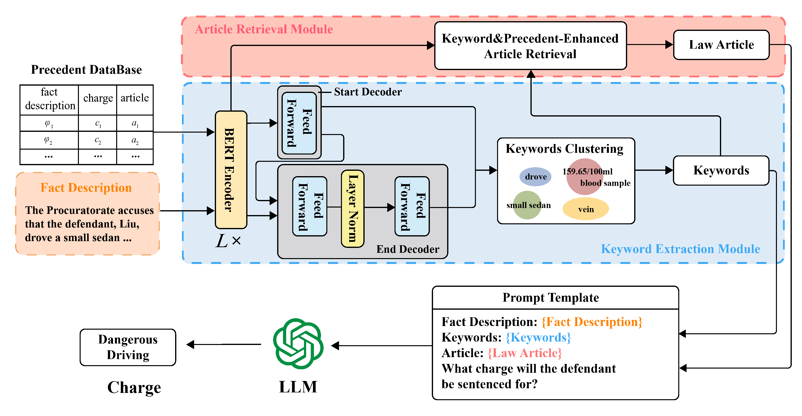

# ⚖️ KnowJudge

📄 Our paper "KnowJudge: A Knowledge-Driven Framework for Legal Judgment Prediction" has been accepted to CogSci 2025 🎉

💡 Code and models will be released soon — stay tuned! 🚀



## 🚀 Usage
You can follow the steps below to set up and run KnowJudge:
1. Clone the repository
```bash
git clone https://github.com/ZhitianHou/KnowJudge
cd KnowJudge
```


2. Download pretrained checkpoints

    To run KnowJudge, you need to download the following pretrained models:
    
    - **Chinese Bert**
    
    Download link: https://huggingface.co/google-bert/bert-base-chinese
    
    After downloading, place the checkpoint files under: `LawKeywordBert/prev_trained_model/`
    
    - **Chinese LLaMA Alpaca 2**
    
    Download link: https://github.com/ymcui/Chinese-LLaMA-Alpaca-2
    
    After downloading, place the checkpoint files under: `models/chinese_alpaca_2_1.3b_rlhf`
   
   - **Lawyer LLaMA**
    
   Download link: https://github.com/AndrewZhe/lawyer-llama
    
   After downloading, place the checkpoint files under: `models/lawyerllama`


3. Train LawKeywordBert
```bash
cd LawKeywordBert
python train_and_test.py --task_name "keyword" --data_dir "datasets/LKR" --model_type "bert" --output_dir "outputs"
```


4. Run KnowJudge Framework
```bash
python main.py --model_path "models/lawyerllama" --bert_model_path "LawKeywordBert/outputsbert"
```


## 📖 Citation
If you find this project helpful, please consider citing our paper:
```bibtet
@misc{KnowJudge2025,
  title        = {KnowJudge: A Knowledge-Driven Framework for Legal Judgment Prediction},
  author       = {Zhitian Hou, Jinlin Li, Ge Lin, and Kun Zeng},
  year         = {2025},
  howpublished = {\url{https://github.com/ZhitianHou/KnowJudge}},
  note         = {Accepted to CogSci 2025.}
}
```


## 🙏 Acknowledgements
This project builds upon the following works:


- [BERT-NER-Pytorch](https://github.com/lonePatient/BERT-NER-Pytorch)
- [Chinese-LLaMA-Alpaca-2](https://github.com/ymcui/Chinese-LLaMA-Alpaca-2)
- [ChatGLM-6B](https://github.com/THUDM/ChatGLM-6B)
- [Lawyer LLaMA](https://github.com/AndrewZhe/lawyer-llama)
- [Fuzi-Mingcha](https://github.com/irlab-sdu/fuzi.mingcha)
- [LexiLaw](https://github.com/CSHaitao/LexiLaw)
- [Hanfei](https://github.com/siat-nlp/HanFei)

Special thanks to the open-source community for their valuable contributions 💖